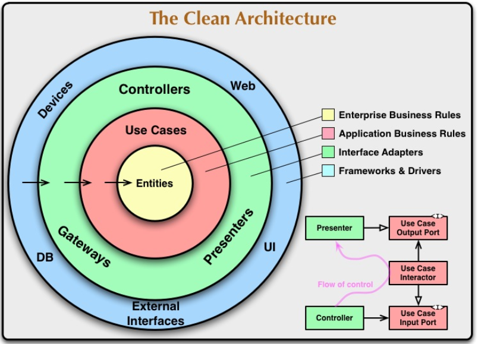
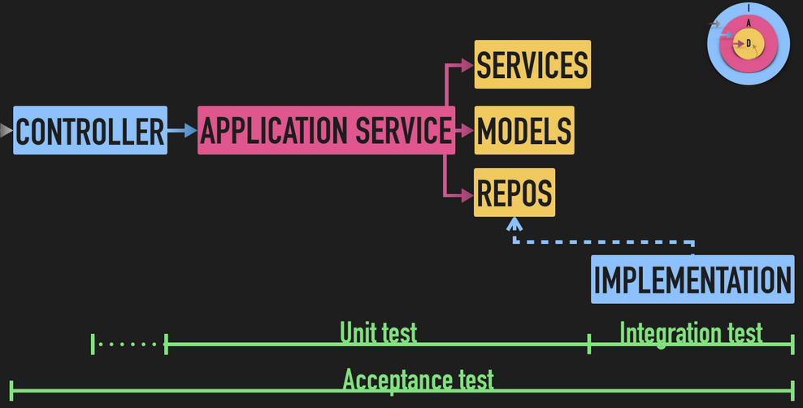
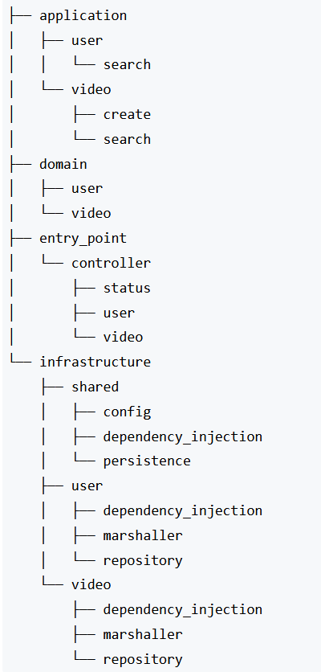
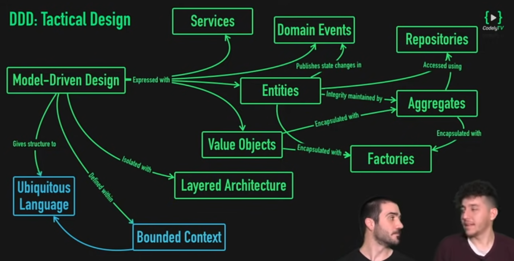
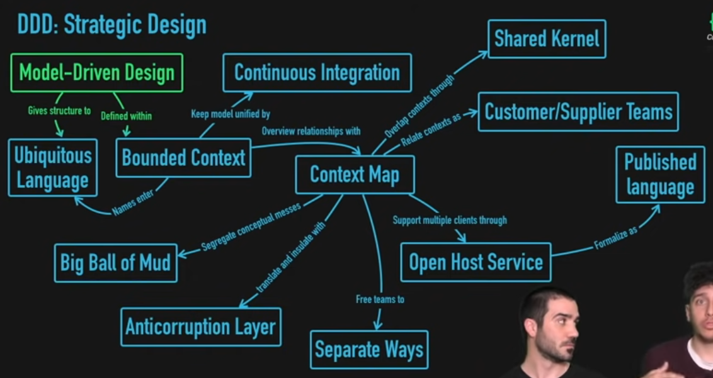

# Hexagonal Arquitecture
### Concepts

[Article - Macro vs Micro Design](https://www.codurance.com/publications/2015/05/12/does-tdd-lead-to-good-design)



#### Workflow

The workflow has the sequence of out ot in such as  
Infraestructure ( controller ) call the applicaction (User case), and application public the 
event domain ( domain, domain service, value Object). In the last case, this can call the repository
interface to do something as send email, save entity to database or REDIS, publish a comment in twitter, etc.

### How to testing

* Unit tests: Application Layer and Domain
* Integration Test: Infrastructure Layer
* Acceptance Test: All layers

### Repository Pattern 

#### Criteria/specification pattern
Another of the concepts that we mention in the video is the criteria pattern. This pattern will help us avoid method explosion in our interfaces and repository implementations when we can filter our searches by complex filter combinatorics.
[Article - Criteria](https://thinkinginobjects.com/2012/08/26/dont-use-dao-use-repository/)

### Structure folders


### Domain Services vs Application service
Domino services represent a grouping of business logic that we can reuse from multiple Application Services (Users Cases).

Let's give an example to explain better. We have two use cases in our application:
* Get a video based on its identifier
* Modify the title of a certain video

In both use cases, we will need the business logic to:
* Go to the video repository to search for a certain video based on its identifier
* Throw a VideoNotFound type domain exception in case the video is not found. It is important to note that the one who throws this exception, as we discussed in the video, is not the repository implementation.
* Return the video if you find it  

To avoid duplicating this business logic in the 2 Application Services, what we usually do is extract it to a Domain Service that we will invoke from both use cases.  

It is important to note that domain services will in no case publish domain events that may occur or manage transactions. We leave that to the Application Service that invokes us to avoid duplication, since it is really he who establishes the "atomicity" of the use case.

### Value Object
Value Objects (VO) or “Value Objects” are nothing more than classes that are identified by the value they represent.

For example, when we talk about our domain entities such as Video, they have an attribute that will be the identifier. Therefore, if you change the title of the video, we still understand that it is the same video since it has the same identifier.

On the other hand, the domain concepts that we model using the VO pattern will be elements such as the URL of the videos. With which, if its value changes, it will no longer represent the same concept. For this reason we say that they are identified by the value they contain.
Finally, **we take the responsibility of the validations of an attribute of the object to a VO**.
In this way we have the benefit of don't replicate code in all project.


### Testing
We have to do:
* Mock of Repository
* Mock of Events
* Create Stub of all ValueObject of us Domain

### Recommendations
* An In-layer doesn't have to know an Out-layer. A way to know easily is watch the import of de service, because an domain service doesn't have to import a class of out of layer.

## Domain-Driven Design (DDD)
### Model-Driven Design
It's represente business model to model in us application. It's expresed in services, entities and Value Object


#### Aggregates
Aggregate, which would be nothing more than a conceptual element that encompasses different entities, in such a way that whenever we want to interact with Lessons, for example, we will do so through Course.

If we want to access the name of the lesson, we will not make a call of the type "course->lesson->name" but we will do it through a method "lessonName()" (we will not attach to each of these chained elements)

In aggregate add all logic relational with attribute always if it non interactive with I/O or other application service.
**Aggregate root**

One module is equals to one aggregate.

### Strategic Design


#### Ubiquitous Language
Use the names to variables, method and classes with the same terminology of us bussiness

#### Bounded Context

#### Shared kernel
They are object that is share between bounded context and between modules. It's object with few elements with
the subject of not carry business logic to another bounded context that isn't necessary

## Concept and Pattern involved  
### Repository

### Role interface vs Header interface
[Video - Luis Artola - Eduardo Ferro](https://www.youtube.com/watch?v=AQK_YgFj7Ng&feature=youtu.be)

Role interface, it's resposive of the client. Such as, 
`List<Product> search(ProductCriteria product);`

Header interface, It's method definition related at the neccesary of implementation of the interface. Such as,
```
List<Product> search(int productID);

List<Product> search(String productName);
```

### Event Bus
Is the array of event where services can suscribe to do something when another service
put event in it. 

It's convenient to decouple functionalities between modules.
**The domain event will be defined in past simple.**


### Anticorruption Layer (ACL)
It's successfully to move from code legacy to new architecture.

### Read Model


### CQRS
Add a new layer between Controllers and Application Services, where is manager for Buses and Handled.

**Tips**
* The relationship established is 1 to 1 between the Command/Query and its Handler
* When use [CQRS Read/Write](https://medium.com/@knoldus/read-model-and-write-model-cqrs-reactive-architecture-3463b5dee9b3) 

#### Command Bus vs Query Bus
**Command bus** is used to call user case asyncronic where the process haven't response
**Query bus** is used to process where return un value, specifically un DTO. **Never the user case return a object model**, otherwise a data transfer object (DTO)


#### Tell, Don’t Ask
When I need calculate the total value from list of children as attribute of a object. Calculate the accumulate when the children changes her value, don't ask all children 
when parent need.