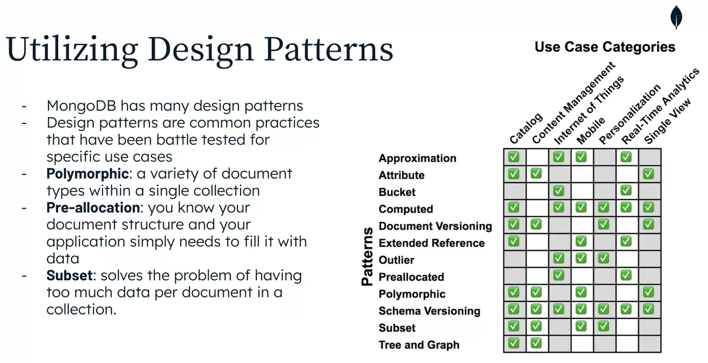

# Databases non-Relational SQL

## Main features
1. databases are flexible to change, is easily can add new attribute a document. Only will add new attribute at the document where it was added.
2. 


## Patters
The solutions with databases non relational is very important define a good model because is very hard fix performance issues  




## Best Practices
1. Imbibe is better than object link unless there is best reason to do. 
2. In relationship one to many where many is too long, pleanse NO imbibe it.
3. Try to avoid $lookups if it is possible, but don't worry if you should propose a better schema design.
4. Arrays can't grow up without limit (it is related with point 2).
5. The database model completely depends on the application access patterns.

### Performance
1. Create indexes
2. Use Covered queries when need get documents finding by only indexes. It's the best performance you can get in a query.
3. Apply Rule ESR (equality, sort, range) to build composite indices. For example,  
```
db.cars.find(
    {
        manufacturer: 'Ford',
        cost: { $gt: 1000 }        
    }).sort({ model : 1})
```
To this query the best index applying the rule ESR is manufacturer, model and cost.  

Index considerations:
- Index need space (disk and RAM)
- Index can get worse the document writing.

## MongoDB
Considerations:
- Data Duplication is not a problem to DB, only de application have to consider when update a data in a document also have to update in others document 
- 

### Atlas search
Allows us to do search by specific text, for example upper case, case-sensitive, etc.

