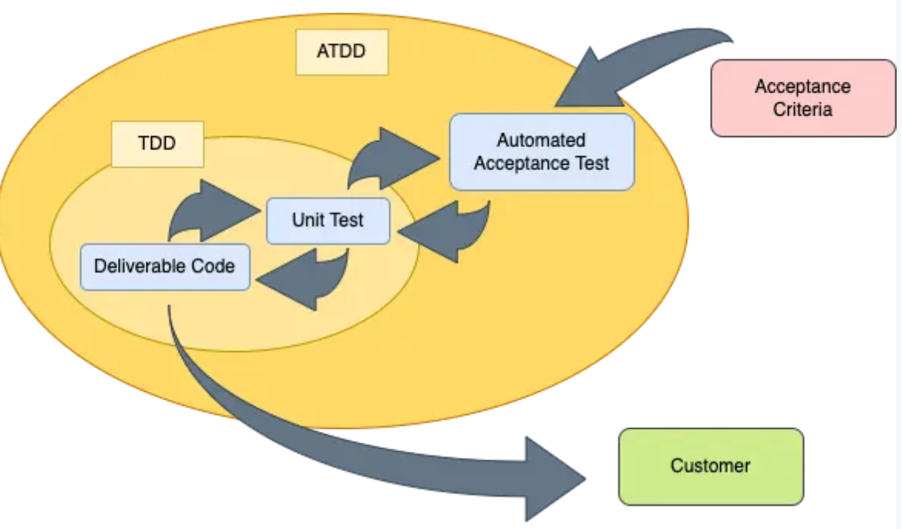

# Testing

### Concepts
Explain general concepts about testing and TDD

#### Fakes
The fakes are nothing more than false implementations that we develop in a 'parallel' way to the real implementation
[HardcodedInMemoryUsersRepository](tdd/src/main/java/com/tdd/app/concepts/HardcodedInMemoryUsersRepository.java)

#### Stubs
For their part, the Stubs bear a certain resemblance to what we have just seen, but unlike the Fake, in this case the values are already predefined and we would not have to pass them as an argument when instantiating it.
[HardcodedInMemoryUsersIntoRepository](tdd/src/main/java/com/tdd/app/concepts/HardcodedInMemoryUsersIntoRepository.java)

#### Mocks
In the case of the Mocks we find a conceptually important difference and that is that unlike the previous ones, what we will do is model the response that the element will give as well as validate the passing of messages, that is, we verify the behavior and collaboration between classes.

```
 @Mock
 private MyRepository myRepo;
```

#### Spy
We can spy a method to know if this method is call in the test
```
 @Spy
 private MyRepository myRepo;
```

### Given-When-Then or Arrange-Act-Assert Pattern
When defining the structure to follow within test cases, one of the most widely used patterns is Given-When-Then, also known as Arrange-Act-Assert.  

The approach he proposes is: Given that there is a certain input scenario, when one or several certain actions take place, then we verify that the generated result is the expected one.

Example:
* it_should_find_an_existing_video()  

**Given**: En este caso podríamos entender que el escenario dado podría ser tanto que tenemos un Video, como también incluir aquí el hecho de tenerlo persistido en nuestro repositorio

**When**: La acción realizada aquí sería la de invocar al caso de uso

**Then**: Finalmente lo esperado en este ejemplo es que la respuesta generada por la acción sea igual que la definida para la aserción (expectedResponse)

### test && commit || revert (TCR)
If test == true, so you do the commit, overwise you do the revert. [Article - Ken Beck](https://medium.com/@kentbeck_7670/test-commit-revert-870bbd756864)

### Acceptance test-driven development (ATDD)



### TDD

#### Cicle (Triangulation method)
**Red**
- Test Code - OK
- Production Code -> KO. Bad Code

**Green**
- Test Code - KO
- Production Code -> OK. I did the code better

**Refactor**
- Test Code - OK
- Production Code -> OK. I did code refactor

#### Three rules
1. You will not write production code without first writing a test that fails.
2. You will not write more than one unit test sufficient to fail (compile errors are failures)
3. You will not write more code than is necessary to make the test pass.

#### Refactoring
**Object Calisthenics**

Object Calisthenics are a set of 10 rules that if we follow them our code will tend towards a more maintainable software design. In the video we focus on the third one: Primitive Wraps.

These are the 10 rules:
1. One level of indentation per method
2. Don't use the else keyword
3. wrap primitives
4. Collections as first-order classes
5. Apply Demeter's Law
6. Not abbreviate
7. Keep entities small
8. Avoid more than two instance attributes
9. Avoid getters and setters or public attributes
10. Stateful classes: avoid static methods

**Transformation Priority Premise (TPP)**
This is the complete table of TPP transformations:
1. ∅ → null
2. null → constant
3. constant → constant+
4. constant → scalar
5. statement → multiple statements
6. not conditional → if
7. scalar → array
8. array → container
9. statement → tail-recursion
10. if → while
11. statement → recursion (not tail)
12. expression → function
13. variable → assignment
14. case, else

**Behaviour Driven Development (BDD)**
It is a combination of several techniques such as TDD and DDD, in which the use of natural language is often associated when establishing the tests.

**DSL**
Using DSL like Gherkin for Acceptance testing adds an abstraction layer (natural language transformation to regular expression tests), which may not pay off:
* It has a generally higher maintenance cost.
* Similar semantics can be achieved in tests that we do directly in code.
* If it is used as documentation, perhaps we are more compensated by other automatic generation tools such as OpenAPI.

**ATDD**
The TDD double loop (also known as ATDD) consists of first writing an acceptance test that fails, and then developing the application internally with normal TDD cycles, until the acceptance test passes. This approach is pushed by the Outside-in development.

Mechanism
**Inside-out**: start with the internal components and work outwards.
**Outside-in**: start from the user delivery mechanism, and build inward.
**Middle-out**: Going inward, but leaving the delivery mechanism for last.
