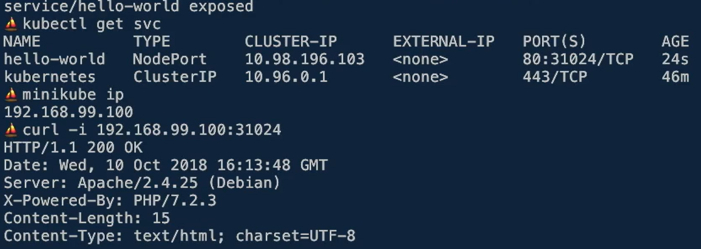

# Kubernetes
## Setup
[Setup init Page](https://kubernetes.io/docs/tasks/tools/)

Tools that you need:
* **kubectl**: allows you to run commands against **Kubernetes clusters**
* **kind**: lets you run Kubernetes on your local computer. 
* **minikube**: runs an all-in-one or a multi-node local Kubernetes cluster on your personal computer
* **kubeadm**:  You can use the kubeadm tool to create and manage Kubernetes clusters

## Tutorial
[hello-world](https://kubernetes.io/docs/tutorials/hello-minikube/)

Use the following command to run the container:
```
docker run -dp 127.0.0.1:8081:8081 hello-node
```

It's necessary to push container in minikube registry
```
# activate config
eval $(minikube docker-env)

# build container
docker build -t hello-node .

# Activate registry 
minikube addons enable registry

# Save container in Minikube registry
docker tag hello-node:latest localhost:5000/hello-node:latest
docker push localhost:5000/hello-node:latest
```

Create k8s deployment
```
kubectl create deployment hello-node --image=hello-node:latest
```
Create a service
```
kubectl expose deployment hello-node --type=LoadBalancer --port=8081
```

Use the minikube docker environment
```
# activate config
eval $(minikube docker-env)

# revert config
eval $(minikube docker-env -u)
```

Clean up
```
kubectl delete service hello-node
kubectl delete deployment hello-node
minikube stop
minikube delete
```

Scale
```
kubectl scale deployment hello-node --replicas=3
```

## API REST
We can tell to kubernetes, through http request what we want status to us application

the request has the follow structure:
* kind: object type
* ApiVersion: structure version
* metadata: Data to identify the object
* spec: desired configuration
* status: current status the object in cluster


## Simple commands

Get list of nodes that Kubernetes are managing
kubectl get nodes

Get list of pods into the Kubernetes
kubectl get pods

Expose port from Kubernetes to server machine  
`kubectl port-forward deployment/hello-world 8000:80`

# Concepts

## Pods
We can deploy application with Pods in Kubernetes. A Pods have must one container of docker.
Each Pods execute with your owner Cgroup, although it has a namespace, all container have the same ip
address. IP is private and only can access for Kubernetes into your red.

Is the smallest thing in Kubernetes.

Generar objecto pod:  
`kubectl run <CONTAINER_NAME> --image=<DOCKER_IMAGE> --restart=NEVER --port=<PORT_EXPOSE> --dry-run -o yml`

Can I save Kubernetess object with > pods.yml

Example from [Codely](https://github.com/fiunchinho/codely-docker)

## Kubectl
Create a Kubernetes from command  
`kubectl create -f pods.yml`

Get all pods:  
`kubecl get pods`

Get status from pods:  
`kubectl describe pod <POD_NAME>`

Edit Kubernetes object on the fly
`kubectl describe pod <POD_NAME>`

Delete pod
`kubectl delete pod <POD_NAME>`

## Health Checker
#### Liveness liveness
Kubernetes has URL endpoint the application to know whether it continue living

#### Readiness probe
It is usefull to know that services is done to receive traffic

## Service Object
Services Discovery allow us send request from App to kubernetes. 
Publish a IP where we can access. 

there are 3 kind of services:
* by default, ClusterIp
* NodePort
* LoadBalance

Create service from pod:
`kubectl expose pod/<POD_NAME> --port 80 --dry-run -o -yml`

Get services available:
`kubectl get svc`

Delete services pod
`kubectl delete svc <POD_NAME>`

Create service with NodePort type:
`kubectl expose pod/<POD_NAME> --port 80 --type=NodePort`



## Deployments Object
I can define how many pods I want, so kubernetes distribute the pods reply through of nodes availability

Get deployment available:
`kubectl get deployments`

Scale replicas:
`kubectl scale deployments <POD_NAME> --replicas=3`

#### Deploy a new version of my app
To edit deployment file you can do it with the command:
`kubectl edit deploy <DEPLOY_NAME>`

* Changes code from my app.
* Modify deployment.yml changing docker name to v2 with the above command.
* After save file, kubernetes deploy the new pod with new version.

## Ingress Object
It's the object describe how manager the traffic that arrive to kubernetes. Ingress has rules to manager, you could define 
paths and your corresponding services to response the request that arrive the path. For example:
```
kind: Ingress
...
spec:
    rules:
    - host: foo.bar.com
      http:
        paths:
        - path: /foo
          backend:
             serviceName: s1
             servicePort: 80
        - path: /bar
          backend:
             serviceName: s2
             servicePort: 80     
```

## ConfigMap Object
Allow to configure variables so that the application can obtain.

We can get values from ConfigMap object as follows:
* By environment variable
* By files in the container
* By application arguments

*When I change the configMap is necessary redeploy the pod.*

## Secrets Object
Save sensible data in files with base64 code.

# Deploy in cluster
## Cluster Configuration
With the command:
`kubectl config view`
We can see all cluster we have configuration like name, IP, users and authentication method. As the following example, 
```
apiVersion: v1
clusters:
- cluster:
    certificate-authority: /home/leoneleg/.minikube/ca.crt
    extensions:
    - extension:
        last-update: Tue, 11 Jul 2023 20:46:17 CEST
        provider: minikube.sigs.k8s.io
        version: v1.30.1
      name: cluster_info
    server: https://127.0.0.1:49154
  name: minikube
contexts:
- context:
    cluster: minikube
    extensions:
    - extension:
        last-update: Tue, 11 Jul 2023 20:46:17 CEST
        provider: minikube.sigs.k8s.io
        version: v1.30.1
      name: context_info
    namespace: default
    user: minikube
  name: minikube
current-context: minikube
kind: Config
preferences: {}
users:
- name: minikube
  user:
    client-certificate: /home/leoneleg/.minikube/profiles/minikube/client.crt
    client-key: /home/leoneleg/.minikube/profiles/minikube/client.key
```

## Deploy in Azure
* Sign up in Azure
* Install the client az to management from command line. [Documentation](https://learn.microsoft.com/en-us/azure/aks/tutorial-kubernetes-deploy-cluster?tabs=azure-cli)
* 

## Deploy in Google Cloud
* Sing up in Google Cloud
* Instal gcloud client to install k8s in cloud
* 

## Deploy in AWS
* Sign up in Amazon
* We have to know that I have to manager of pod in AWS, It's necessary create S3, etc.
* 